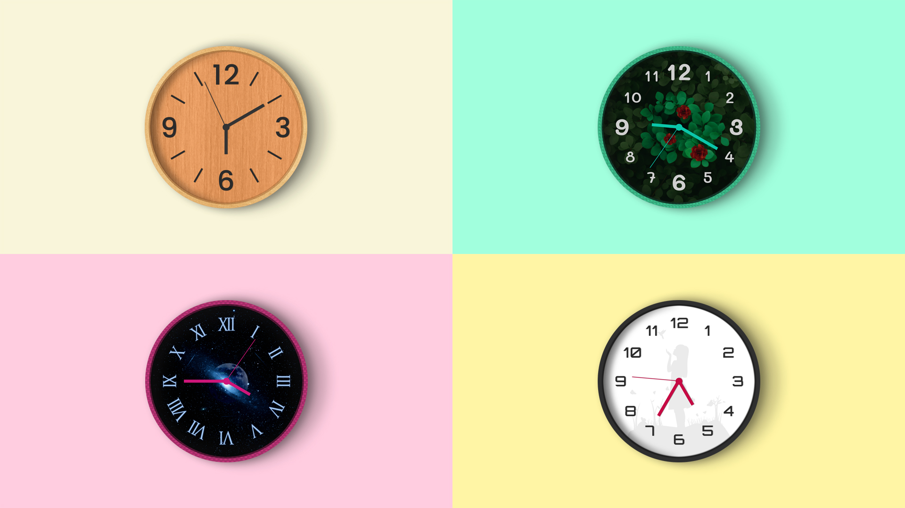
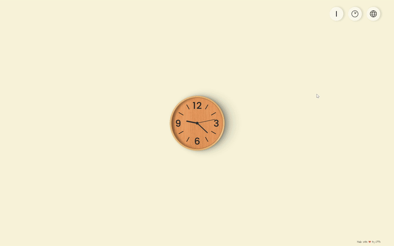

# Live World Clock




## Introduction

An aethetic live world clock designed to display accurate time across differeent time zones seamlessly. Built with modern web technologies such as React and SCSS, this project aims to provide a visually appealing and highly functional tool for users to keep track of time in various parts of the world.

## Setup Instructions

### 1. Clone the Repository

Clone the repository using the following command:

```bash
git clone [repository_url]
```

### 2. Add Environment Variables

Refer to the `template.env` file provided in the repository. Add your own environment variables based on the template using the provided
[GeoCode API](https://rapidapi.com/Noggle/api/reverse-geocoding-and-geolocation-service/playground/apiendpoint_13d32d7f-b167-4024-b83c-5a5ef2affe2c) and [TimeZoneDB API](https://timezonedb.com)

### 4. Install Dependencies

First, navigate to the root directory of the project and run:

```bash
npm install
```

### 5. Run the Application

After installing all dependencies, you can start the application by running:

```bash
npm run dev
```

This will start the application in your default web browser.

## Acknowledgements

## Dependencies

-  **react:** ^18.2.0
-  **react-dom:** ^18.2.0
-  **react-icons:** ^4.8.0

## DevDependencies

-  **@types/react:** ^18.0.28
-  **@types/react-dom:** ^18.0.11
-  **@vitejs/plugin-react:** ^4.0.0
-  **eslint:** ^8.38.0
-  **eslint-plugin-react:** ^7.32.2
-  **eslint-plugin-react-hooks:** ^4.6.0
-  **eslint-plugin-react-refresh:** ^0.3.4
-  **sass:** ^1.62.1
-  **vite:** ^4.3.2
